<div align="center">



<br/>


<br/>

<a href="https://rootcamp.dev"></a>
<a href="https://graalforge.com"></a>
<a href="https://www.linkedin.com/in/steven-le-bris/"></a>


</div>


---

## `>_ whoami`

```yaml
identity:
  handle:   PercevalFox 🦊
  name:     Steven Le Bris
  role:     Lead DevSecOps · Pentester · Cybersecurity Expert · Enseignant
  location: France · remote-first
  org:      rootcamp.dev  |  GraalForge

posture:
  blue_team:  [ SOC, CERT, IR, Threat Hunting, Hardening, Conformité OIV ]
  red_team:   [ Pentest, Red Team, Social Engineering, Post-exploitation ]
  purple:     "je casse ce que je construis, puis je le reconstruis mieux"

fleet_managed:    1900+ serveurs (RHEL 6→9)
years_in_it:      11+
teaching:         ESGI — sécu SI, Linux, social engineering, gouvernance
```

---

## `>_ ls -R /opt/arsenal`

<div align="center">

**Le noyau — ce que je touche toutes les semaines**


</div>

<details>
<summary><b>⌨️ Langages & scripting</b> <sub>(18)</sub></summary>

<div align="center">


</div>

</details>

<details>
<summary><b>🐧 Systèmes & hyperviseurs</b> <sub>(18)</sub></summary>

<div align="center">


</div>

</details>

<details>
<summary><b>📦 Conteneurs & orchestration</b> <sub>(12)</sub></summary>

<div align="center">


</div>

</details>

<details>
<summary><b>☁️ Cloud & Infrastructure as Code</b> <sub>(12)</sub></summary>

<div align="center">


</div>

</details>

<details>
<summary><b>♾️ CI/CD, GitOps & supply chain</b> <sub>(12)</sub></summary>

<div align="center">


</div>

</details>

<details>
<summary><b>🗡️ Sécurité offensive & Red Team</b> <sub>(18)</sub></summary>

<div align="center">


</div>

</details>

<details>
<summary><b>🛡️ SOC, CERT & détection</b> <sub>(20)</sub></summary>

<div align="center">


</div>

</details>

<details>
<summary><b>🔬 AppSec & analyse de code</b> <sub>(12)</sub></summary>

<div align="center">


</div>

</details>

<details>
<summary><b>🔐 Secrets, IAM & policy-as-code</b> <sub>(11)</sub></summary>

<div align="center">


</div>

</details>

<details>
<summary><b>📈 Observabilité & alerting</b> <sub>(12)</sub></summary>

<div align="center">


</div>

</details>

<details>
<summary><b>🌐 Réseau & edge</b> <sub>(13)</sub></summary>

<div align="center">


</div>

</details>

<details>
<summary><b>🗄️ Données & messaging</b> <sub>(8)</sub></summary>

<div align="center">


</div>

</details>

<details>
<summary><b>🤖 Automatisation & SOAR</b> <sub>(7)</sub></summary>

<div align="center">


</div>

</details>

<details>
<summary><b>📜 Référentiels & conformité</b> <sub>(10)</sub></summary>

<div align="center">


</div>

</details>


<div align="center">
<sub>Une techno = un truc que j'ai mis en prod, cassé, ou enseigné. Pas une ligne de CV.</sub>
</div>

---

## `>_ journalctl -u carriere --no-pager`

> Chaque mission est un incident résolu. Déplie pour lire le rapport.

<details>
<summary><b>🦊 <code>2019 → now</code> · Uncle Web — Freelance · <i>Lead DevSecOps / Cyber / Enseignant</i></b></summary>

<br/>

| # | Mission | Contexte | Cœur du sujet |
|:-:|---------|----------|---------------|
| 1 | Analyste Cyber Réaction | OIV | Phishing, domaines frauduleux, workflows d'alerting, JS pour n8n/TheHive, SOAR, procédures de compromission |
| 2 | Expert Conformité & Scripting | OIV | PowerShell Active Directory, analyse & mailing de reports, mise en conformité |
| 3 | Lead DevSecOps & Intégration | OIV | Intégration applicative, conformité NSSI/PSSI, analyse d'attaques subies, scripting multi-stack |
| 4 | Sécurisation Infra IA & Hardware | 🔒 NDA | Durcissement technique **et physique** (NUC) d'une infra IA |
| 5 | Migration Cloud & Kubernetes | Cloud-to-cloud | RBAC, Kyverno, modules K8s, audit de sécurité + pentest |
| 6 | Automatisation Legacy | Transformation | Nouvelles automatisations, montée en compétence des équipes |
| 7 | Cybersécurité & Red Team | 🇫🇷 Défense / souverain | Évaluations offensives encadrées, restitution COMEX + technique, sécurisation post-exercice |

</details>

<details>
<summary><b>⚡ <code>2022 → 2024</code> · Inov Team Labs · <i>Consultant DevSecOps / SysOps / SecOps</i></b></summary>

<br/>

```console
$ fleet --status
 ▸ 1900+ serveurs pilotés          RHEL 6 · 7 · 8 · 9
 ▸ implantation Kubernetes         + SRE
 ▸ conteneurs & orchestration      Docker · Podman · Swarm · K8s · vSphere
 ▸ gouvernance & sécurité          Rapid7 · Red Hat Security · recherche de failles
 ▸ gestion de projet               migration DCIM
 ▸ pompier de service              debug transverse toutes équipes
```

</details>

<details>
<summary><b>🎓 <code>2023 → 2024</code> · ESGI · <i>Enseignant — Sécurité & Administration Linux</i></b></summary>

<br/>

**Enseigné :** gouvernance des données · sécurisation du SI · législation des outils offensifs · Linux avancé (Ubuntu, CentOS, Kali, Debian, RHEL) · hardening · social engineering (attaque, défense, cadre légal).

**Projets étudiants pilotés :**
- `spy-pixel` — éthique & légalité, implémentation, détection, contre-mesures
- `monitoring-box` — Grafana + Prometheus + AlertManager de bout en bout

</details>

---

## `>_ find . -name "*.lab" -type d`

| Lab | Ce qu'il fait | Stack |
|-----|---------------|-------|
| **[opicluster_monitoring](https://github.com/PercevalFox/opicluster_monitoring)** | Infra de supervision full-stack Raspberry Pi + Orange Pi : alerting, dashboards, intégrations Discord/SMS, détection de menaces, durcissement |    |
| **[monitoring-and-secure-containers](https://github.com/PercevalFox/monitoring-and-secure-containers)** | Surveillance et audit continus de la sécurité des conteneurs, détection de comportements anormaux à l'exécution |    |
| **[ci-cd-secrets-management](https://github.com/PercevalFox/ci-cd-secrets-management)** | Gestion sécurisée des secrets dans les pipelines : intégration, rotation automatique, vérification |    |
| **[secure-cicd-pipeline](https://github.com/PercevalFox/secure-cicd-pipeline)** | Pipeline CI/CD durci : tests de sécurité automatisés à chaque étape du dev |    |
| **[security-analysis-cicd](https://github.com/PercevalFox/security-analysis-cicd)** | Analyse statique et dynamique intégrée au pipeline pour web apps et microservices |   |
| **[Security-fondamentals](https://github.com/PercevalFox/Security-fondamentals)** | App web pédagogique illustrant les concepts fondamentaux de la sécurité des SI |   |

<div align="center">
<a href="https://github.com/PercevalFox?tab=repositories"></a>
</div>

---

## `>_ tail -f /var/log/github.log`

<div align="center">


<br/>


<sub>Carte générée par GitHub Actions et commitée dans ce repo — aucune dépendance externe au rendu.</sub>

</div>

---

## `>_ ./snake --eat-contributions`

<div align="center">

<picture>
  <source media="(prefers-color-scheme: dark)" srcset="https://raw.githubusercontent.com/PercevalFox/PercevalFox/output/snake-dark.svg" />
  <source media="(prefers-color-scheme: light)" srcset="https://raw.githubusercontent.com/PercevalFox/PercevalFox/output/snake.svg" />
  
</picture>

</div>

---

## `>_ cat /etc/rootcamp/manifest`

<div align="center">

```
┌────────────────────────────────────────────────────────────────┐
│  rootcamp.dev — on n'apprend pas la sécu en regardant des      │
│  slides. On l'apprend en cassant des choses, dans un lab,      │
│  avec quelqu'un qui explique pourquoi ça a cassé.              │
└────────────────────────────────────────────────────────────────┘
```

**Ce que j'ouvre volontiers :** labs reproductibles · pipelines CI/CD durcis · monitoring & détection · pédagogie cyber
**Ce que je ne publierai jamais :** ce qui relève du NDA, de l'OIV ou du souverain. 🔒

</div>

---

<div align="center">

### `>_ nc -lvnp 4444`

<a href="https://www.linkedin.com/in/steven-le-bris/"></a>
<a href="https://rootcamp.dev"></a>
<a href="https://github.com/PercevalFox?tab=repositories"></a>

<br/><br/>

<sub><code>Le renard ne court pas plus vite que les chiens. Il connaît juste mieux le terrain.</code></sub>


</div>
